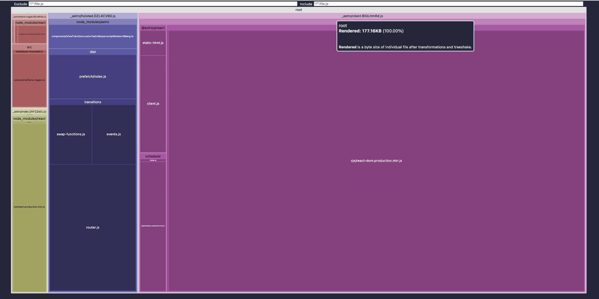
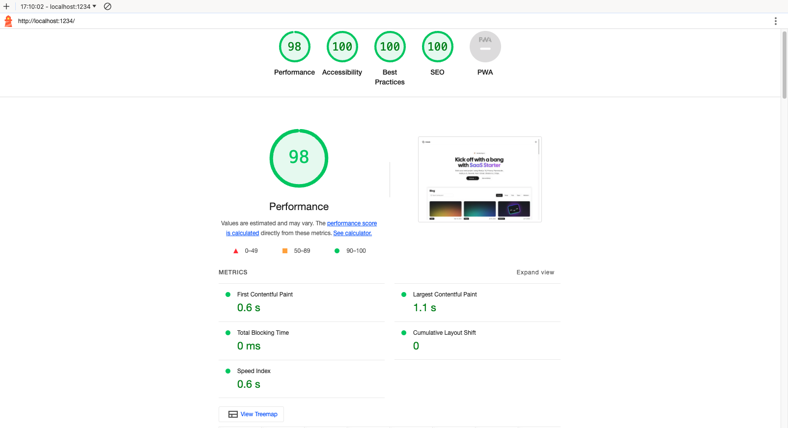

# Astro-React-Radix-Tailwind Starter
This repository serves as a lightweight starter template for building projects using Astro, React, Radix UI, and Tailwind CSS.

Originally inspired by the work in the [astro-nomy](https://github.com/mickasmt/astro-nomy) repository, this template is designed to provide a solid foundation for developers looking to explore how Astro can work with React and Tailwind CSS, enhanced with the accessibility-ready components from Radix UI.

## Features

- **Astro**: Modern build optimizations with a focus on performance.
- **React**: Flexible JavaScript library for building user interfaces.
- **Radix UI**: Components for building high-quality design systems and web apps.
- **Tailwind CSS**: Utility-first CSS framework for rapidly building custom designs.

### Project Structure

    ├── public/
    │   └── fonts/
    ├── src/
    │   ├── components/
    │   ├── config/
    │   ├── content/
    │   ├── hooks/
    │   ├── icons/
    │   ├── layouts/
    │   ├── lib/
    │   ├── pages/
    │   ├── styles/
    │   └── types/
    ├── astro.config.mjs
    ├── README.md
    ├── package.json
    ├── tailwind.config.cjs
    └── tsconfig.json

## Production Build Size is 178kb.
Optimized production build totals only 178kb, ensuring quick load times and an enhanced user experience. Performance tests show that the template:

- Loads in less than 3 seconds on a fast 3G network.
- Loads in less than 10 seconds on a slow 3G network.

## Lighthouse Report
Lighthouse score of 100, indicating that it meets the highest standards in performance, accessibility, best practices, and SEO. This makes it an excellent choice for developers looking to build high-quality web applications.

## Component Diagram

Clone this repository to get started with your project:

    npm install
    npm run dev